# HubSpot AI Lead Management & Customer Onboarding System

### End-to-End CRM Automation for Lead Capture, Qualification, Sales Follow-Up, Customer Onboarding & Lead Reactivation

A production-minded CRM automation system built with **n8n, HubSpot, AI, Tally, Gmail, Google Sheets, and Slack** to manage the operational lifecycle of a B2B customer — from the first enquiry through CRM management, sales follow-up, customer onboarding, and the reactivation of inactive opportunities.

The system reduces repetitive CRM administration, improves pipeline visibility, supports timely sales follow-up, and creates a structured transition from sales to customer onboarding.

> **Lead enters → AI qualifies → CRM is organized → Sales gets actionable follow-up → Deal is won → Onboarding begins → Inactive opportunities can be reactivated.**

---

## The Problem

As businesses grow, managing leads and opportunities inside a CRM can become increasingly manual.

Sales teams may have to:

- Review and qualify new enquiries
- Create or update contacts, companies, and deals
- Keep CRM information organized
- Monitor active opportunities for follow-up
- Remember when deals need attention
- Manually coordinate the transition from sales to delivery
- Collect client onboarding information
- Create internal tasks and notifications
- Revisit old opportunities that have gone inactive

Without a structured process, this can lead to **missed follow-ups, inconsistent CRM records, forgotten opportunities, and unnecessary administrative work**.

The challenge is not simply capturing leads.

It is managing the operational work that happens throughout the **customer lifecycle**.

---

## The Solution

This system connects lead management, sales pipeline operations, customer onboarding, and lead reactivation into one structured CRM automation system.

A new enquiry enters through the lead form. n8n processes the submission, AI evaluates the opportunity, and HubSpot becomes the central system of record for the contact, company, deal, qualification, priority, ownership, and next action.

From there, the connected workflows support the sales and customer lifecycle:

```text
Lead Enquiry
    ↓
Workflow 1 — AI Lead Management
    ↓
Workflow 2 — Sales Pipeline & Follow-Up
    ↓
Human Sales Decision
    ↓
Closed Won
    ↓
Workflow 3 — Customer Onboarding
    ↓
Project Kickoff

Inactive Open Opportunities
    ↓
Workflow 4 — Lead Reactivation
    ↓
Return to Active Sales Management
```

The goal is not to replace the sales team.

The goal is to **automate repetitive operational work while keeping important customer and commercial decisions under human control**.

---

# Core Capabilities

### AI-Powered Lead Management

Processes new enquiries, evaluates qualification and priority, and prepares structured information for CRM processing.

### Automated CRM Record Management

Checks for existing Contacts, Companies, and Deals before creating or updating CRM records.

### AI Pipeline Health Analysis

Regularly reviews active opportunities and identifies deals that may require sales attention.

### Risk-Based Follow-Up

AI evaluates deal context and recommends the appropriate sales action, including risk level, task title, and task description.

### Dynamic Follow-Up Scheduling

The urgency of the AI assessment determines how quickly the sales owner should act.

```text
HIGH   → Next day at 9 AM
MEDIUM → In 2 days at 9 AM
LOW    → In 3 days at 9 AM
```

### Automated Customer Onboarding

Closed-Won deals transition into a structured onboarding process with client communication, information collection, CRM tasks, tracking, and internal notifications.

### Lead Reactivation

Open opportunities that remain inactive for **30+ days** can be identified and prepared for controlled re-engagement.

### Duplicate Protection

The system includes safeguards against unnecessary duplicate:

- Contacts
- Companies
- Deals
- Follow-up tasks
- Onboarding processes
- Reactivation outreach

### Human-in-the-Loop Sales Control

Automation analyzes, recommends, and prepares operational actions, while the salesperson retains responsibility for the final sales decision.

---

# How It Works

The system consists of four connected workflows that support different stages of the CRM lifecycle.

## Workflow 1 — AI-Powered Lead Management

A prospect submits a business enquiry through the lead form.

The workflow:

1. Captures and structures the enquiry
2. Preserves the unique submission reference
3. Uses AI to assess the opportunity
4. Checks for existing Contact and Company records
5. Checks whether an existing Deal should be reused
6. Creates or updates the required HubSpot records
7. Associates the CRM records
8. Resolves the appropriate sales owner
9. Records qualification, priority, and next action
10. Sends the appropriate client and internal communication

**Outcome:** a raw enquiry becomes an organized CRM opportunity ready for sales follow-up.

---

## Workflow 2 — Sales Pipeline & Follow-Up

Getting opportunities into HubSpot is only the beginning.

This workflow performs a scheduled health check of active opportunities and evaluates the context around each deal.

It considers:

- Recent activity
- Days since activity
- Deal progress
- Days in stage
- Scheduled activity
- Future activity
- Overdue activity
- Existing tasks
- Deal owner
- Qualification
- Priority
- Next action

AI then determines whether the opportunity is healthy or requires attention.

When action is required, the system prepares a recommended follow-up and creates an appropriate HubSpot task for the sales owner.

Existing active follow-up tasks are checked first to prevent unnecessary duplicates.

**Outcome:** the CRM actively helps the sales team identify where attention is needed.

---

## Workflow 3 — Customer Onboarding

When the salesperson moves an opportunity to **Closed Won**, the sales process transitions into customer onboarding.

The deal remains **Closed Won** while the operational handoff begins.

```text
Closed Won
    ↓
Onboarding Initiation
    ↓
Onboarding Record
    ↓
Welcome Email
    ↓
Client Onboarding Form
    ↓
Client Submission
    ↓
Onboarding Record Update
    ↓
Kickoff Task
    ↓
Slack Notification
    ↓
Prepare Project Kickoff
```

The onboarding process collects information such as:

- Company details
- Contact information
- Communication preference
- Tools and platforms
- Access/setup requirements
- Preferred start date
- Important project notes
- Additional information

The submission is matched back to the correct onboarding process using the onboarding and deal references.

**Outcome:** the handoff from sales to delivery becomes structured and traceable.

---

## Workflow 4 — Lead Reactivation

Not every prospect is ready to buy immediately.

The reactivation workflow runs daily and identifies **open opportunities that have been inactive for at least 30 days**.

The workflow:

1. Detects inactive open opportunities
2. Reviews the existing sales context
3. Uses AI to prepare an appropriate re-engagement action
4. Checks for recent reactivation outreach
5. Prevents duplicate outreach
6. Sends reactivation communication when appropriate
7. Monitors for a response
8. Creates a sales follow-up task if the prospect responds
9. Notifies the sales owner
10. Returns the opportunity to active sales management

The existing deal is preserved.

No duplicate deal is created.

**Outcome:** previously inactive opportunities have a structured path back into the sales pipeline.

---

# Architecture — System Design

The complete system is documented across five architecture diagrams.

### Master CRM Architecture

[View Master CRM Architecture](docs/crm-master-architecture.pdf)

### Workflow 1 — AI-Powered Lead Management

[View Workflow 1 Architecture](docs/workflow-01-lead-management-architecture.pdf)

### Workflow 2 — Sales Pipeline & Follow-Up

[View Workflow 2 Architecture](docs/workflow-02-sales-pipeline-follow-up-architecture.pdf)

### Workflow 3 — Customer Onboarding

[View Workflow 3 Architecture](docs/workflow-03-customer-onboarding-architecture.pdf)

### Workflow 4 — Lead Reactivation

[View Workflow 4 Architecture](docs/workflow-04-lead-reactivation-architecture.pdf)

### System Design Principle

**HubSpot** serves as the central CRM system of record, while **n8n** orchestrates the workflows connecting CRM operations, AI analysis, forms, email, onboarding tracking, and internal notifications.

```text
                    Lead / Customer
                          │
                          ▼
                    ┌───────────┐
                    │    n8n    │
                    │Orchestrator│
                    └─────┬─────┘
                          │
             ┌────────────┼────────────┐
             ▼            ▼            ▼
        ┌─────────┐  ┌─────────┐  ┌─────────┐
        │ HubSpot │  │ AI / LLM │  │  Tally  │
        │   CRM   │  │          │  │  Forms  │
        └────┬────┘  └─────────┘  └────┬────┘
             │                          │
             ▼                          ▼
       Sales Operations          Client Onboarding
             │                          │
             └────────────┬─────────────┘
                          ▼
                   Gmail / Sheets /
                       Slack
```

---

# Demo

## 🎥 See the System in Action

The full walkthrough demonstrates how the system manages a business enquiry from initial lead capture through CRM management, sales pipeline follow-up, customer onboarding, and lead reactivation.

**Demo video:** *Coming soon*

The final walkthrough video will be added here once uploaded.

---

# Project Screenshots

## Lead Management

### Lead Enquiry Form

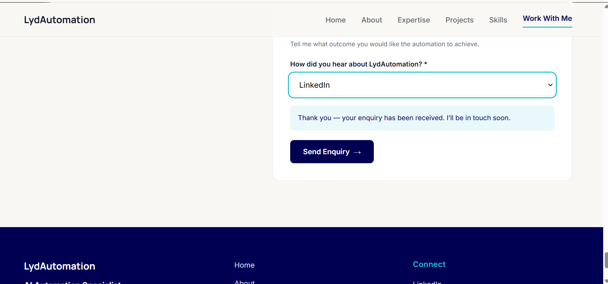


### Workflow 1 — Lead Management

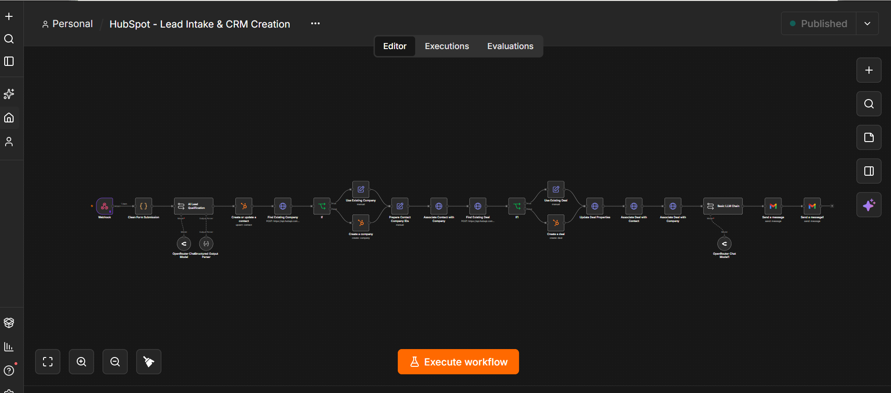


### HubSpot Deal

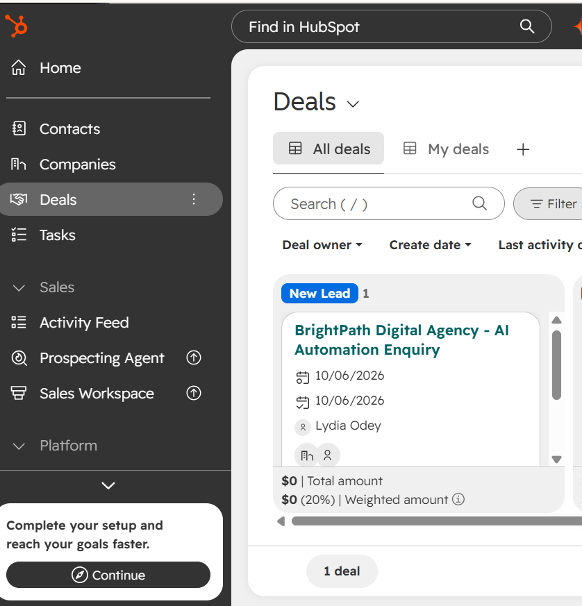


### AI Lead Qualification

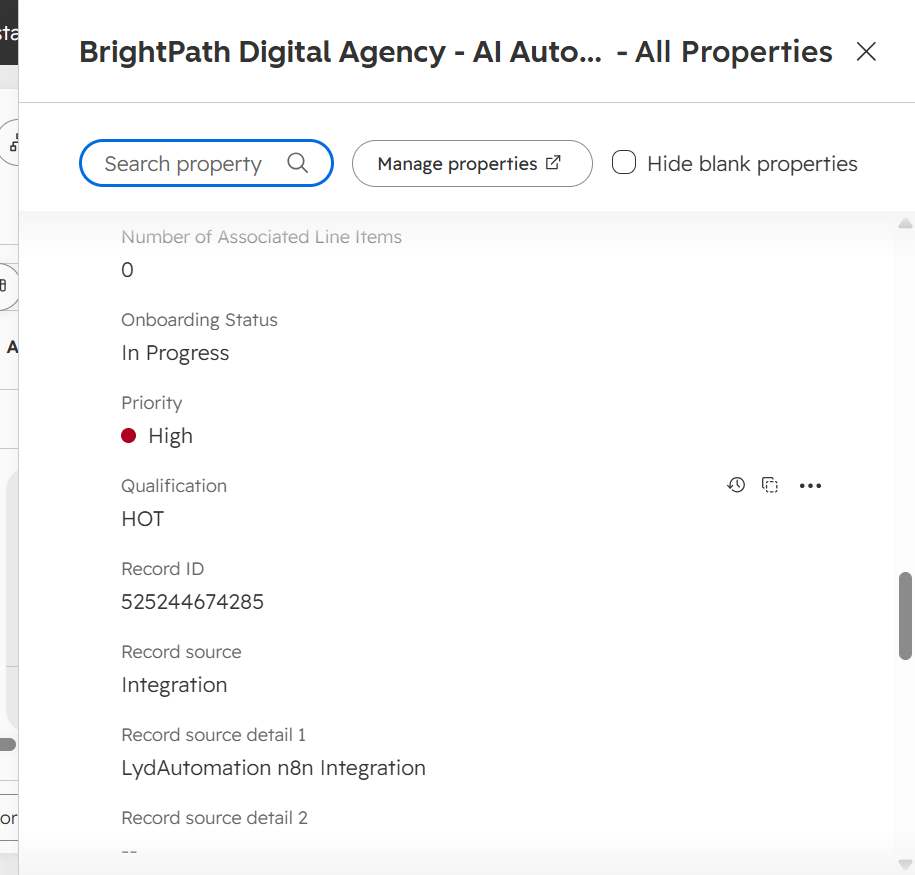

---

## Sales Pipeline & Follow-Up

### Workflow 2 — Pipeline Health

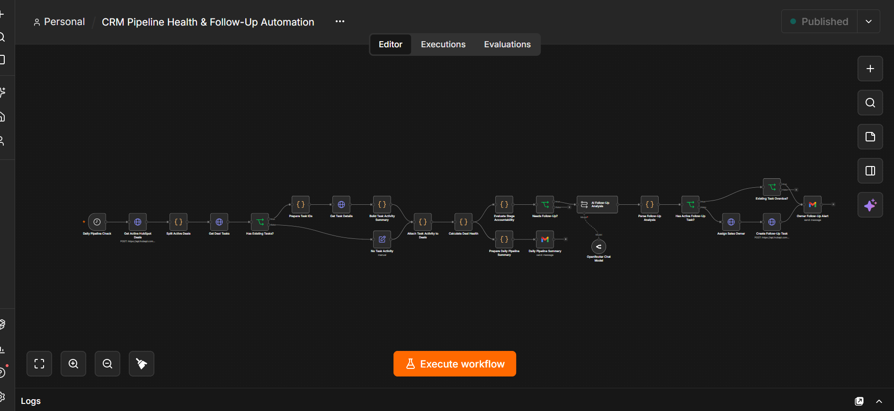


### HubSpot Follow-Up Task

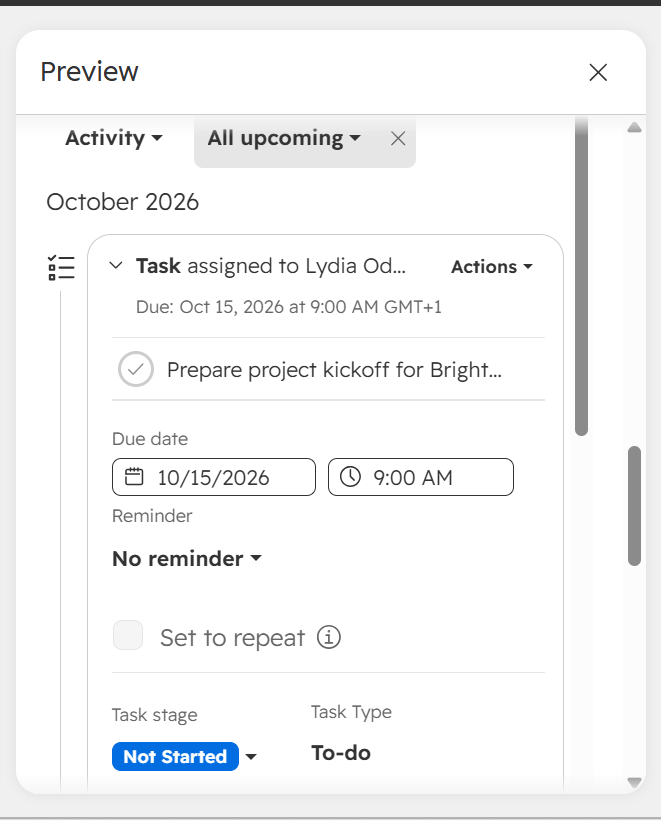


### Pipeline Health Notification

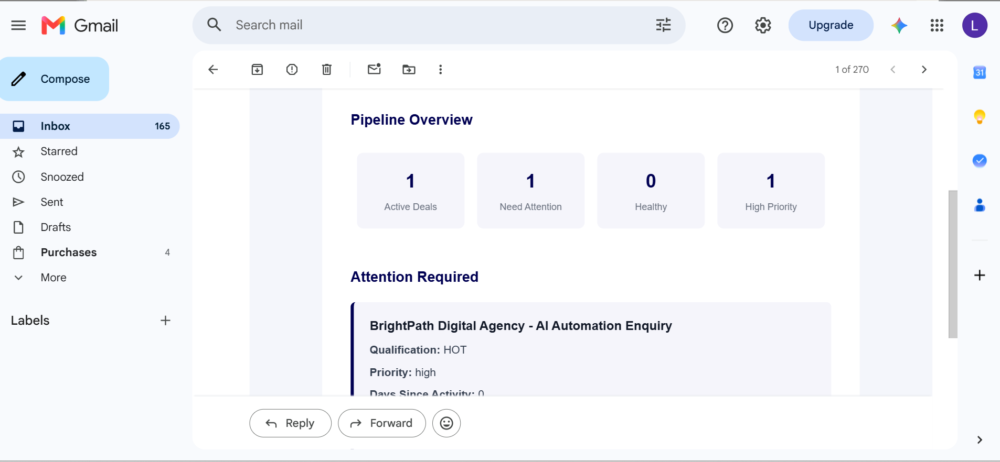

---

## Customer Onboarding


### Workflow 3 — Customer Onboarding

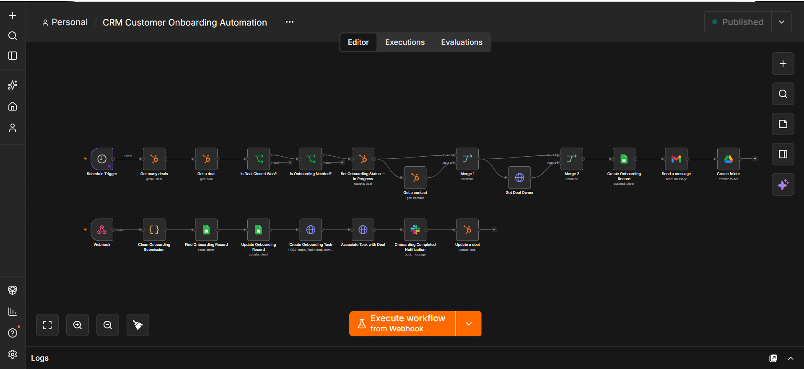


### Closed-Won Deal

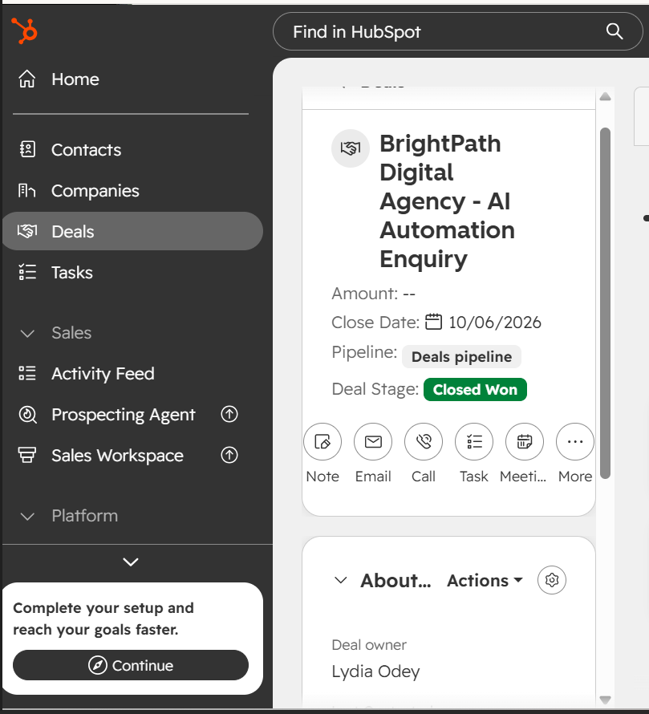


### Client Onboarding Form

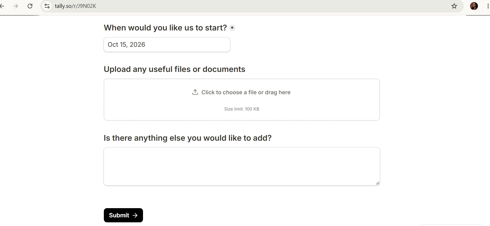


### Client Welcome Email

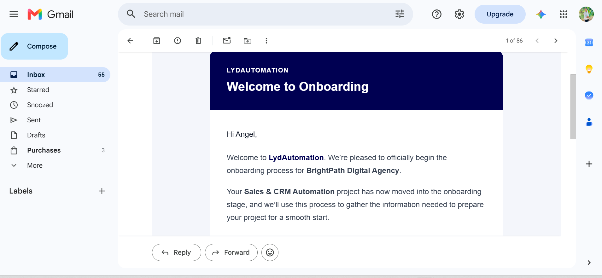


### Onboarding Tracker

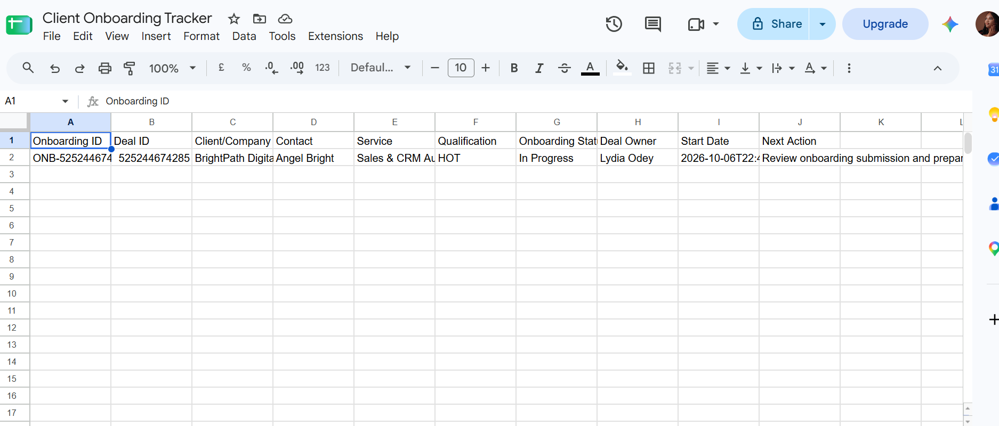


### Slack Onboarding Notification

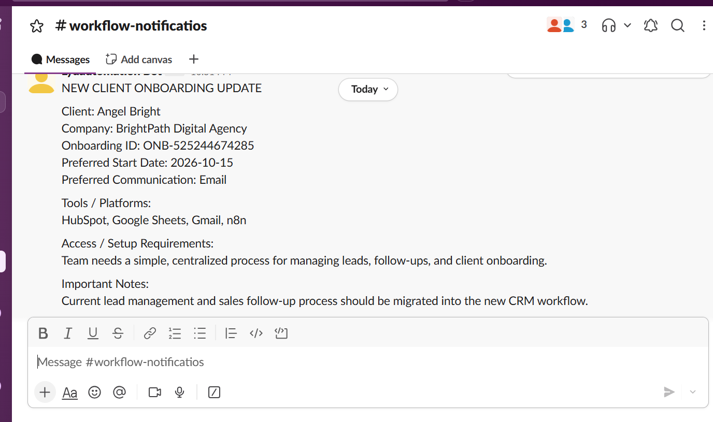

---

## Lead Reactivation


### Workflow 4 — Lead Reactivation

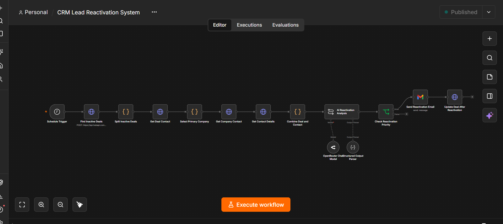

---

# Human-in-the-Loop

The system is designed to support the sales team without removing human judgment from important customer decisions.

```text
Automation
    ↓
Monitors
    ↓
Analyzes
    ↓
Recommends
    ↓
Creates Operational Tasks
    ↓
Notifies Sales Owner

Human
    ↓
Reviews Context
    ↓
Engages Customer
    ↓
Makes Final Sales Decision
    ↓
Moves Deal to Closed Won
```

The automation does **not** automatically determine that a prospect has purchased.

The salesperson remains responsible for the final commercial decision.

> **The automation handles repetitive operational work. The human remains in control of the customer relationship and final sales decision.**

---

# Monitoring & Reliability

The workflows include controls designed to make the system reliable and predictable in a real CRM environment.

### Scheduled Pipeline Monitoring

The pipeline health workflow runs on a scheduled basis to identify active opportunities that may require attention.

### 30-Day Reactivation Threshold

Lead reactivation uses a defined inactivity threshold to avoid arbitrary or premature outreach.

### Duplicate Protection

Existing CRM records, tasks, onboarding states, and recent outreach are checked before new actions are created.

### Existing Deal Preservation

Reactivation works with the existing opportunity instead of creating a new duplicate deal.

### Follow-Up Task Protection

Existing active follow-up tasks are checked before another task is created.

### Onboarding Protection

The onboarding workflow checks the onboarding state before initiating another onboarding process.

### Closed-Won Integrity

Customer onboarding does not reopen the sales opportunity. The deal remains **Closed Won** while the customer moves into delivery.

### Controlled Reactivation

Reactivation outreach is only performed when the opportunity meets the defined inactivity and eligibility conditions.

### Human Review

AI recommendations support the sales team without replacing human commercial judgment.

---

# Tech Stack

| Technology | Purpose |
|---|---|
| **n8n** | Workflow orchestration and automation |
| **HubSpot** | CRM, Contacts, Companies, Deals, Tasks and pipeline management |
| **AI / LLM** | Lead qualification, opportunity analysis and follow-up recommendations |
| **Tally** | Lead enquiry and client onboarding forms |
| **Gmail** | Client communication and reactivation outreach |
| **Google Sheets** | Customer onboarding tracking |
| **Slack** | Internal sales and onboarding notifications |
| **HubSpot API** | CRM records, associations and task operations |
| **JavaScript** | Data transformation, normalization and workflow logic |

---

# Privacy & Data Handling

This project was designed with practical data-handling considerations in mind.

- Demo customer and company information is fictional.
- Sensitive credentials are not collected through the onboarding form.
- The onboarding form instructs users not to submit passwords, API keys, login credentials, or other sensitive information.
- CRM operations are performed through authenticated integrations.
- Data is passed between systems only when required for the relevant business process.
- Duplicate checks help prevent unnecessary creation and propagation of CRM records.
- Sales and onboarding processes are separated into defined lifecycle stages.

For production deployments, authentication, permissions, data retention, access controls, and applicable privacy requirements should be configured according to the client's environment.

---

# Business Value

### Reduced CRM Administration

Automates repetitive contact, company, deal, task, and onboarding operations.

### Faster Sales Follow-Up

AI-assisted pipeline analysis helps surface opportunities that need attention.

### Better Pipeline Visibility

Sales teams can identify unhealthy or inactive opportunities without manually reviewing every deal.

### Revenue Recovery

Inactive opportunities receive a structured path toward reactivation.

### Faster Customer Handoff

Closed-Won deals transition into a defined onboarding process automatically.

### Better Internal Coordination

HubSpot, email, onboarding tracking, and Slack work together as one operational process.

### Better Customer Experience

Clients receive a structured onboarding journey with the information the delivery team needs to begin work.

---

> **Less manual CRM work. Fewer forgotten opportunities. A smoother journey from lead to client.**

---

# Technical Highlights

This project demonstrates practical implementation of:

- n8n workflow orchestration
- HubSpot CRM API integration
- CRM record creation and updates
- Contact, Company, and Deal associations
- AI structured outputs
- Prompt engineering
- Conditional workflow logic
- JavaScript data transformation
- Data normalization
- Webhook processing
- Dynamic date and time calculations
- Scheduled workflows
- Duplicate prevention
- HubSpot task creation
- Gmail automation
- Tally form integration
- Google Sheets lookup and update
- Slack notifications
- Human-in-the-loop workflow design

---

# Key Design Decisions

### Human-Controlled Sales Decisions

Automation supports sales decisions without automatically determining when a deal is won.

### CRM as the Source of Truth

HubSpot remains the central system for customer and sales lifecycle information.

### Risk-Based Automation

AI-generated risk levels determine the urgency of recommended sales follow-up.

### Duplicate Protection

The system checks existing CRM state before creating new records or operational actions.

### Lifecycle Separation

Lead management, sales follow-up, customer onboarding, and lead reactivation are treated as distinct but connected business stages.

### Data Traceability

Submission and onboarding references keep client information connected to the correct CRM opportunity.

### Structured Sales-to-Delivery Handoff

Closed Won marks the transition from sales into a defined customer onboarding process.

### Controlled Lead Reactivation

Inactive opportunities are re-engaged through a dedicated workflow without creating duplicate deals or disrupting the existing CRM lifecycle.

---

# What This Project Demonstrates

```text
✓ CRM Automation
✓ n8n Workflow Development
✓ HubSpot API Integration
✓ AI Workflow Design
✓ Prompt Engineering
✓ Lead Qualification
✓ Sales Pipeline Automation
✓ Follow-Up Automation
✓ Customer Onboarding Automation
✓ Lead Reactivation
✓ Webhook Integration
✓ Data Transformation
✓ Conditional Logic
✓ Duplicate Prevention
✓ Google Workspace Automation
✓ Slack Integration
✓ Human-in-the-Loop Systems
✓ Business Process Automation
```

---

# Built by Lydia Ogbene-Odey

**AI Automation Specialist | Health Tech Automation | Sales & CRM Automation**

I design and build practical automation systems that connect business processes, reduce repetitive work, improve operational visibility, and help teams spend more time on high-value work.

My work focuses on **AI-powered workflow automation, CRM automation, business process automation, and health technology solutions**.

### Let's Connect

- **Portfolio:** https://lydautomation.github.io/
- **GitHub:** https://github.com/Lydautomation
- **LinkedIn:** https://linkedin.com/in/lydia-ogbene-odey-800268421

---

## Need a CRM or Business Process Automated?

I build custom automation systems that connect CRMs, forms, AI, email, spreadsheets, communication platforms, and internal business processes.

> **Let's automate the repetitive work so your team can focus on the work that actually grows the business.**# hubspot-ai-crm-automation
